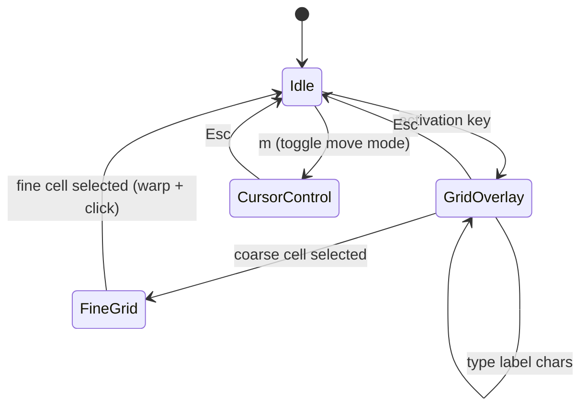

# mouseless

Keyboard-only mouse control for macOS, written in Haskell. Inspired by Vim easymotion / Homerow-style labeling.

## How it works



1. **Activation** — press the activation key to show a coarse grid overlay over the screen.
2. **Label selection** — each cell shows a key sequence (e.g. `a`, `s`, `aa`). Type the sequence to select; after a coarse cell, a **fine grid** opens inside that region for precision.
3. **Free movement** — from idle, `h` `j` `k` `l` nudge the cursor by pixel steps (default 8px).
4. **Grid-step movement** — press `m` to toggle between free-range and larger grid-aligned steps within a region.
5. **Click** — `Space` / `Enter` left-clicks at the cursor.

## Architecture

Pure functional core, imperative shell:

| Layer | Modules | Role |
|-------|---------|------|
| Core | `Geometry`, `Grid`, `Charset`, `Input`, `State`, `Commands` | Pure state machine + effects |
| Platform | `Platform.Class`, `Platform.MacOS`, `Platform.Mock` | Screen, events, cursor I/O |
| App | `App`, `Main` | Event loop |

The `step` function in `Mouseless.Core.State` is the entire logic: `(Config, AppState, Event) -> (AppState, [Effect])`.

## Setup

Install [GHCup](https://www.haskell.org/ghcup/) then:

```bash
cd ~/mouseless
stack build
stack test
```

Run the stdin demo (no Accessibility permissions needed yet):

```bash
stack exec mouseless
# or scripted mock event sequence:
stack exec mouseless -- --mock
```

## macOS production path

The current `Platform.MacOS` module is a **stdin stub**. Next steps for real overlay + global hotkeys:

1. **Accessibility** — enable for `mouseless` in System Settings → Privacy & Security → Accessibility.
2. **Global hotkey** — `CGEventTap` (via small Objective-C FFI shim) to listen while other apps are focused.
3. **Overlay** — transparent `NSPanel` at screen-saver window level, drawing grid lines + labels (likely `HSXCGEvent` / custom `foreign import` or a tiny Swift helper).
4. **Cursor** — `CGWarpMouseCursorPosition` + `CGEventPost` for clicks.

The Haskell core stays unchanged; only `Platform.MacOS` grows.

## Key bindings (default)

| Key | Action |
|-----|--------|
| activation (`a` in demo) | Show grid overlay |
| `a`–`m`, `q`–`p`, etc. | Grid label input |
| `h` `j` `k` `l` | Move cursor left/down/up/right |
| `m` | Toggle free-range ↔ grid-step movement |
| `Space` / `Enter` | Left click |
| `Esc` | Cancel overlay / exit move mode |
| `q` | Quit |

## Configuration

Edit `defaultConfig` in `src/Mouseless/Core/State.hs`:

- `cfgGrid` — coarse/fine column and row counts
- `cfgFreeStep` — pixel step for free movement (default 8)
- `cfgGridStep` — pixel step for grid movement (default 24)
- `cfgAutoFineGrid` — open fine grid after coarse selection (default `True`)

## License

MIT
